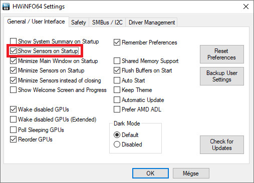
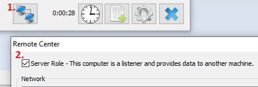

# ESP8266 HWiNFO64 Client
A HWiNFO64 client for reading sensor values from a PC.

## Example
**[PrintSensorValues](examples/PrintSensorValues/PrintSensorValues.ino)** example output:
```
[0x09 0x7000020] = 0.00
[0x09 0x8000001] = 40.23
[0x09 0x8000002] = 246.06
[0x09 0x8000003] = 8.00
[0x09 0x8000004] = 88.00
[0x0A 0x8000000] = 827.29
[0x0A 0x8000001] = 125.90
[0x0A 0x8000002] = 5.27
[0x0A 0x8000003] = 3.52
[0x0B 0x8000000] = 0.00
```

Where:

| Value       | Description  |
|-------------|--------------|
| `0x09`      | Group ID     |
| `0x8000004` | Sensor ID    |
| `88.00`     | Sensor value |

## HWiNFO settings

Set this to start sensors automatically:



Set **Server Role**, for allowing incoming connections:



## Depends on external lib:
* https://github.com/me-no-dev/ESPAsyncTCP
